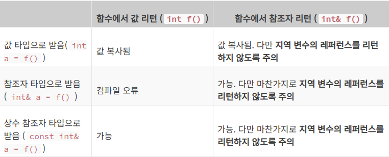

# 레퍼런스`&`(참조자)의 도입 
- 참조자를 정의하는 방법은, 가리키고자 하는 타입 뒤에 `&`를 붙이면 된다.
    ```c++
    int a = 3;
    int& another_a = a;
    ```
---
### 레퍼런스 이해하기

#### 1. 레퍼런스는 반드시 처음에 누구의 별명이 될 것인지 지정해야 합니다.
- `int& another_a;` 와 같은 문장은 불가능하다.

#### 2. 레퍼런스가 한 번 별명이 되면 절대로 다른 이의 별명이 될 수 없다.
- 예시문
    ```c++
    int a = 10;
    int &another_a = a; // another_a 는 이제 a 의 참조자!

    int b = 3;
    another_a = b; // ?? 
    ```
- 이것은 그냥 `a`에 `b`를 대입하라는 의미일 뿐이다.

#### 3. 레퍼런스는 메모리 상에 존재하지 않을 수 도 있다.
- 예시
    ```c++
    int a = 10;
    int &another_a = a; // another_a 가 자리를 차지할 필요가 있을까?
    ```
- another_a 가 쓰이는 자리는 모두 a 로 바꿔치기 하면 되니까 이 경우 레퍼런스는 메모리상에 존재하지 않는다.(항상 그런것은 아님.)

#### 4. 함수 인자로 레퍼런스 받기
- 예시
    ```c++
    #include <iostream>

    int change_val(int &p) {
        p = 3;

        return 0;
    }
    int main() {
        int number = 5;

        std::cout << number << std::endl;
        change_val(number);
        std::cout << number << std::endl;
    }
    ```
- 참조자 `p`에게 "너는 앞으로 `number`의 새로운 별명이야" 라고 알려주는 것이다.
- <b>중요한 점</b>은 `number` 앞에 `&`를 붙일 필요가 없다는 점이다.

### 레퍼런스의 올바른 사용(주의점)

#### 1. 상수에 대한 참조자
- 예시
    ```c++
    #include <iostream>

    int main() {
    int &ref = 4;   // 오류 발생

    std::cout << ref << std::endl;
    }
    ```
- 상수 값 자체는 리터럴 이기 때문에 만일 레퍼런스로 참조한다면 `ref = 5;`로 말도 안되는 행위가 되는 것이다.
- 상수 참조자로 선언한다면 리터럴도 참조할 수 있다.
    ```c++
    const int &ref = 4;
    ```
#### 2. 레퍼런스의 배열과 배열의 레퍼런스
- 예시
    ```c++
    int a, b;
    int& arr[2] = {a, b};   // 컴파일 오류 발생.(illegal)
    ```
- 표준안 8.3.2/4 를 보면 놀랍게도 언어 차원에서 불가능 하다고 못 박아버렸습니다.
- 이유는
    - 주소값이 존재한다라는 의미는 해당 원소가 메모리 상에서 존재한다 라는 의미와 같습니다. 
    - 하지만 레퍼런스는 특별한 경우가 아닌 이상 메모리 상에서 공간을 차지 하지 않습니다. 
    - 따라서 이러한 모순 때문에 레퍼런스들의 배열을 정의하는 것은 언어 차원에서 금지가 되어 있는 것입니다.
- 배열들의 레퍼런스를 사용하는 예시
    ```c++
    #include <iostream>

    int main() {
        int arr[3] = {1, 2, 3};
        int(&ref)[3] = arr; // arr를 ref가 참조한다.

        ref[0] = 2;
        ref[1] = 3;
        ref[2] = 1;

        std::cout << arr[0] << arr[1] << arr[2] << std::endl;
        return 0;
    }
    ```
#### 3. 레퍼런스를 리턴하는 함수
- 예시
    ```c++
    int& function() {
        int a = 2;
        return a;
    }

    int main() {
        int b = function();     // 런타임 오류 발생
        b = 3;
        return 0;
    }
    ```
- `int b = function();`는 `function`의 리턴 타입은 `int&` 이다. (참조자를 리턴)
- 함수가 종료되고나면 `a`는 함수와 함께 사라진다.
- 이처럼 원래 참조 하던 것이 사라진 레퍼런스를 <b>댕글링 레퍼런스 (Dangling reference)</b> 라고 부릅니다. 
- 따라서 레퍼런스를 리턴하는 함수에서 지역 변수의 레퍼런스를 리턴하지 않도록 조심해야 합니다.

#### 4. 외부 변수의 레퍼런스를 리턴
- 예시
    ```c++
    int& function(int& a) {
        a = 5;
        return a;
    }

    int main() {
        int b = 2;
        int c = function(b);
        return 0;
    }
    ```
- 인자로 받은 레퍼런스를 그대로 리턴 하고 있다.
- `function(b)` 를 실행한 시점에서 `a` 는 main 의 `b` 를 참조하고 있게 된다.
- 따라서 아직 살아있는 변수 `b`를 계속 참조한다.
- 장점으로 레퍼런스가 참조하는 타입의 크기와 상관 없이 딱 한 번의 주소값 복사로 전달이 끝나게 된다. 따라서 매우 효율적이게 되는 것이다.

#### 5. 참조자가 아닌 값을 리턴하는 함수를 참조자로 받기
- 예시
    ```c++
    int function() {
    int a = 5;
    return a;
    }

    int main() {
    int& c = function();    // 컴파일 오류 발생
    return 0;
    }
    ```
- 아까전 상황과 마찬가지로 함수의 리턴값은 해당 문장이 끝난 후 바로 사라지는 값이기 때문에 댕글링 레퍼런스가 되어버린다.

#### 6. C++에서 중요한 예외 규칙이 있다.
- 예시
    ```c++
    #include <iostream>

    int function() {
        int a = 5;
        return a;
    }

    int main() {
        const int& c = function();
        std::cout << "c : " << c << std::endl;
        return 0;
    }
    ```
- 예외적으로 상수 레퍼런스로 리턴값을 받게 되면 해당 리턴값의 생명이 연장된다.
- 레퍼런스가 사라질 때 까지.

## 정리해보자면,

